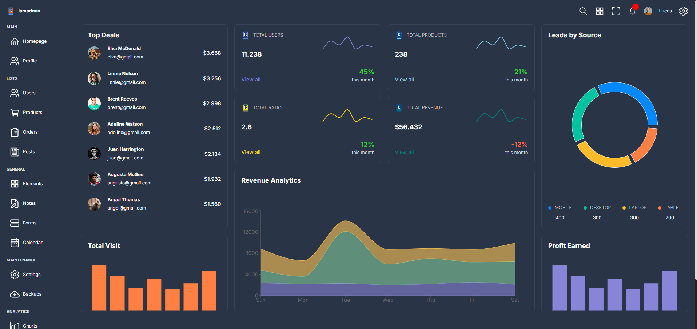
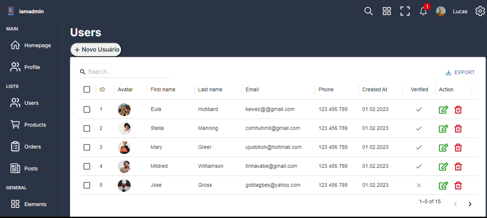
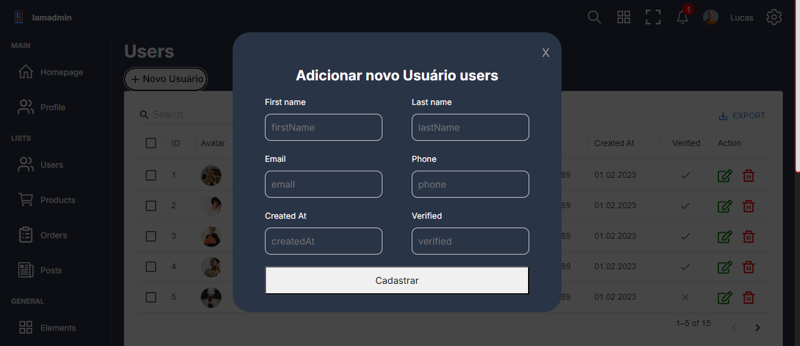

## Projeto desenvolvido com 
Esse é um projeto Dashboard 
Esse projeto é o desenvolvimento de um Front-End  com React e utilizando a biblioteca de grafico Recharts e biblioteca Mui 

## Site do Projeto 
https://dashboard-five-delta-83.vercel.app/

## Imagem do Projeto
<!--  -->

<!-- usuarios -->

## Objetivos
Criar um Inteface interativa 

## Repositorio do Projeto para clonar
git clone https://github.com/JacquelineCasali/Dashboard.git

Seleciona o botão code vai na opção Download ZIP

## Rodar o Projeto no FrontEnd 

-  cd frontEnd
-  npm install
-  npm run dev

## 🛠 Tecnologias utilizadas

- **[Rect]**
- **[Vite]**
- **[Recharts]**
- **[Mui]**

## 📝 Licença

Projeto desenvolvido por CasaliTech.
