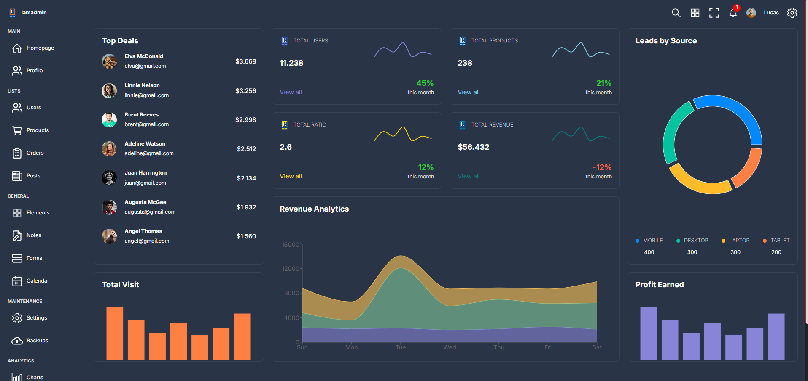

## Projeto desenvolvido com 
Esse é um projeto Dashboard 
Esse projeto é o desenvolvimento de um Front-End  com React e utilizando a biblioteca de grafico Recharts 

## Site do Projeto 
https://burgers-restaurant-react.vercel.app/

## Imagem do Projeto
<!--  -->

## Objetivos
Criar um Inteface interativa 

## Repositorio do Projeto para clonar
git clone git  git remote add origin https://github.com/JacquelineCasali/Dashboard.git

Seleciona o botão code vai na opção Download ZIP

## Rodar o Projeto no FrontEnd 

$ cd frontEnd
$ npm install
$ npm run dev

## 🛠 Tecnologias utilizadas

- **[Rect]**
- **[Vite]**
-  **[Recharts]**

## 📝 Licença

Projeto desenvolvido por CasaliTech.
